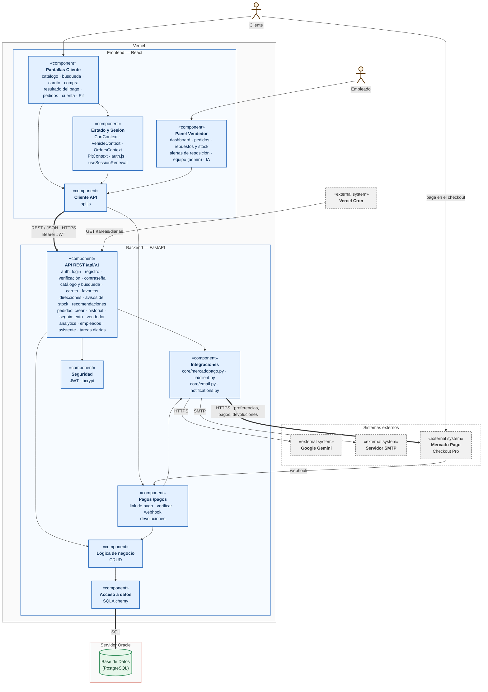

# Diagrama de componentes

Vista interna de Frontend y Backend.

```mermaid
---
config:
  theme: mc
  layout: dagre
---
flowchart TB
    Cliente@{ img: "", label: "Cliente", pos: "b", w: 40, h: 64, constraint: "on" }
    Empleado@{ img: "", label: "Empleado", pos: "b", w: 40, h: 64, constraint: "on" }

    subgraph Vercel["Vercel"]
        subgraph FE["Frontend — React"]
            Pantallas["«component»<br/><b>Pantallas Cliente</b><br/>catálogo · búsqueda · carrito · compra<br/>resultado del pago · pedidos · cuenta · Pit"]:::component
            PanelEmp["«component»<br/><b>Panel Vendedor</b><br/>dashboard · pedidos · repuestos y stock<br/>alertas de reposición · equipo (admin) · IA"]:::component
            Estado["«component»<br/><b>Estado y Sesión</b><br/>CartContext · VehicleContext · OrdersContext<br/>PitContext · auth.js · useSessionRenewal"]:::component
            ApiCli["«component»<br/><b>Cliente API</b><br/>api.js"]:::component
        end

        subgraph BE["Backend — FastAPI"]
            API["«component»<br/><b>API REST /api/v1</b><br/>auth: login · registro · verificación · contraseña<br/>catálogo y búsqueda · carrito · favoritos<br/>direcciones · avisos de stock · recomendaciones<br/>pedidos: crear · historial · seguimiento · vendedor<br/>analytics · empleados · asistente · tareas diarias"]:::component
            Pagos["«component»<br/><b>Pagos /pagos</b><br/>link de pago · verificar · webhook<br/>devoluciones"]:::component
            Integ["«component»<br/><b>Integraciones</b><br/>core/mercadopago.py · ia/client.py<br/>core/email.py · notifications.py"]:::component
            Seg["«component»<br/><b>Seguridad</b><br/>JWT · bcrypt"]:::component
            Logica["«component»<br/><b>Lógica de negocio</b><br/>CRUD"]:::component
            ORM["«component»<br/><b>Acceso a datos</b><br/>SQLAlchemy"]:::component
        end
    end

    subgraph ServidorOracle["Servidor Oracle"]
        DB[("Base de Datos<br/>(PostgreSQL)")]:::database
    end

    subgraph Externos["Sistemas externos"]
        direction TB
        Gemini["«external system»<br/><b>Google Gemini</b>"]:::external
        SMTP["«external system»<br/><b>Servidor SMTP</b>"]:::external
        MP["«external system»<br/><b>Mercado Pago</b><br/>Checkout Pro"]:::external
    end
    Cron["«external system»<br/><b>Vercel Cron</b>"]:::external

    Cliente --> Pantallas
    Empleado --> PanelEmp
    Cliente -->|"paga en el checkout"| MP

    Pantallas --> Estado
    Pantallas --> ApiCli
    Estado --> ApiCli
    PanelEmp --> ApiCli

    ApiCli ==>|"REST / JSON · HTTPS<br/>Bearer JWT"| API
    ApiCli --> Pagos

    API --> Seg
    API --> Logica
    Pagos --> Logica
    Pagos --> Integ
    API --> Integ
    Cron -->|"GET /tareas/diarias"| API
    Logica --> ORM

    ORM ==>|"SQL"| DB
    Integ ==>|"HTTPS · preferencias, pagos, devoluciones"| MP
    MP -->|"webhook"| Pagos
    Integ -->|"HTTPS"| Gemini
    Integ -->|"SMTP"| SMTP

    classDef actor fill:#fff4e0,stroke:#d9822b,stroke-width:2px,color:#5a3200
    classDef component fill:#e3f0ff,stroke:#2f6fbf,stroke-width:2px,color:#0b2a52
    classDef external fill:#f1f1f1,stroke:#7a7a7a,stroke-width:2px,stroke-dasharray:5 3,color:#333
    classDef database fill:#e6f6ea,stroke:#2e8b57,stroke-width:2px,color:#0f3d24

    style Cliente fill:none,stroke:none
    style Empleado fill:none,stroke:none
    style Vercel fill:#fafafa,stroke:#000,stroke-width:1px
    style FE fill:#f7fbff,stroke:#2f6fbf,stroke-width:1px
    style BE fill:#f7fbff,stroke:#2f6fbf,stroke-width:1px
    style Externos fill:#ffffff,stroke:#7a7a7a,stroke-width:1px,stroke-dasharray:5 3
    style ServidorOracle fill:#fafafa,stroke:#c74634,stroke-width:1px
```

**Leyenda:** azul = componente del sistema · gris punteado = sistema externo.
