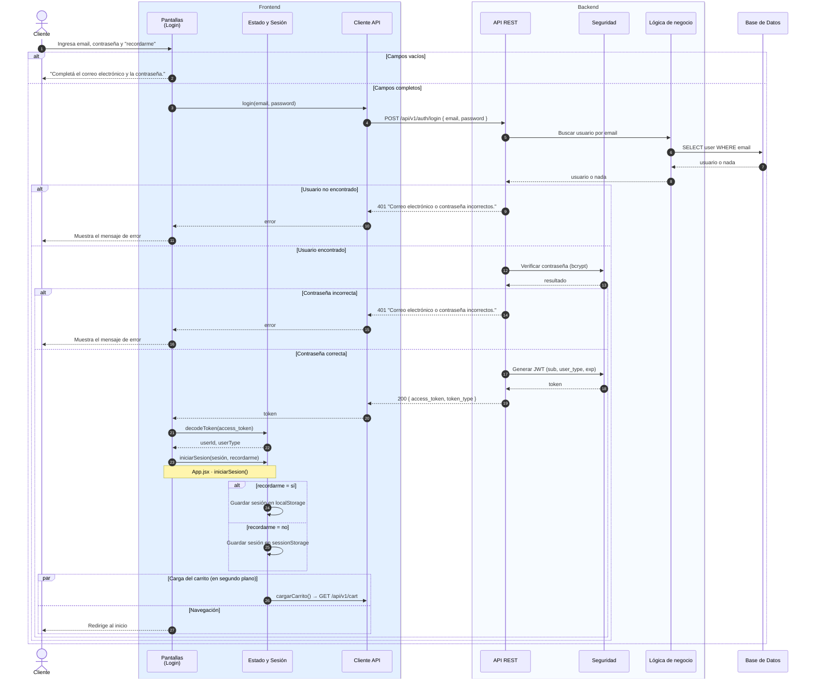

# Secuencia: inicio de sesión

```mermaid
---
config:
  theme: mc
---
sequenceDiagram
    autonumber
    actor C as Cliente

    box rgb(227,240,255) Frontend
        participant P as Pantallas<br/>(Login)
        participant S as Estado y Sesión
        participant A as Cliente API
    end

    box rgb(247,251,255) Backend
        participant R as API REST
        participant Seg as Seguridad
        participant L as Lógica de negocio
    end

    participant DB as Base de Datos

    C->>P: Ingresa email, contraseña y "recordarme"

    alt Campos vacíos
        P-->>C: "Completá el correo electrónico y la contraseña."
    else Campos completos
        P->>A: login(email, password)
        A->>R: POST /api/v1/auth/login { email, password }
        R->>L: Buscar usuario por email
        L->>DB: SELECT user WHERE email
        DB-->>L: usuario o nada
        L-->>R: usuario o nada

        alt Usuario no encontrado
            R-->>A: 401 "Correo electrónico o contraseña incorrectos."
            A-->>P: error
            P-->>C: Muestra el mensaje de error
        else Usuario encontrado
            R->>Seg: Verificar contraseña (bcrypt)
            Seg-->>R: resultado

            alt Contraseña incorrecta
                R-->>A: 401 "Correo electrónico o contraseña incorrectos."
                A-->>P: error
                P-->>C: Muestra el mensaje de error
            else Contraseña correcta
                R->>Seg: Generar JWT (sub, user_type, exp)
                Seg-->>R: token
                R-->>A: 200 { access_token, token_type }
                A-->>P: token
                P->>S: decodeToken(access_token)
                S-->>P: userId, userType

                P->>S: iniciarSesion(sesión, recordarme)
                Note over P,S: App.jsx · iniciarSesion()
                alt recordarme = sí
                    S->>S: Guardar sesión en localStorage
                else recordarme = no
                    S->>S: Guardar sesión en sessionStorage
                end

                par Carga del carrito (en segundo plano)
                    S->>A: cargarCarrito() → GET /api/v1/cart
                and Navegación
                    P-->>C: Redirige al inicio
                end
            end
        end
    end
```
