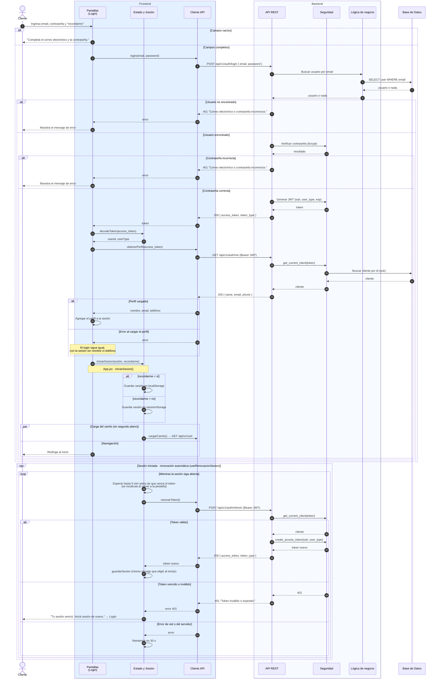

# Secuencia: inicio de sesión

```mermaid
---
config:
  theme: mc
---
sequenceDiagram
    autonumber
    actor C as Cliente

    box rgb(227,240,255) Frontend
        participant P as Pantallas<br/>(Login)
        participant S as Estado y Sesión
        participant A as Cliente API
    end

    box rgb(247,251,255) Backend
        participant R as API REST
        participant Seg as Seguridad
        participant L as Lógica de negocio
    end

    participant DB as Base de Datos

    C->>P: Ingresa email, contraseña y "recordarme"

    alt Campos vacíos
        P-->>C: "Completá el correo electrónico y la contraseña."
    else Campos completos
        P->>A: login(email, password)
        A->>R: POST /api/v1/auth/login { email, password }
        R->>L: Buscar usuario por email
        L->>DB: SELECT user WHERE email
        DB-->>L: usuario o nada
        L-->>R: usuario o nada

        alt Usuario no encontrado
            R-->>A: 401 "Correo electrónico o contraseña incorrectos."
            A-->>P: error
            P-->>C: Muestra el mensaje de error
        else Usuario encontrado
            R->>Seg: Verificar contraseña (bcrypt)
            Seg-->>R: resultado

            alt Contraseña incorrecta
                R-->>A: 401 "Correo electrónico o contraseña incorrectos."
                A-->>P: error
                P-->>C: Muestra el mensaje de error
            else Contraseña correcta
                R->>Seg: Generar JWT (sub, user_type, exp)
                Seg-->>R: token
                R-->>A: 200 { access_token, token_type }
                A-->>P: token
                P->>S: decodeToken(access_token)
                S-->>P: userId, userType

                P->>A: obtenerPerfil(access_token)
                A->>R: GET /api/v1/auth/me (Bearer JWT)
                R->>Seg: get_current_client(token)
                Seg->>DB: Buscar cliente por id (sub)
                DB-->>Seg: cliente
                Seg-->>R: cliente
                R-->>A: 200 { name, email, phone }
                alt Perfil cargado
                    A-->>P: nombre, email, teléfono
                    P->>P: Agregar el perfil a la sesión
                else Error al cargar el perfil
                    A-->>P: error
                    Note over P: El login sigue igual,<br/>con la sesión sin nombre ni teléfono
                end

                P->>S: iniciarSesion(sesión, recordarme)
                Note over P,S: App.jsx · iniciarSesion()
                alt recordarme = sí
                    S->>S: Guardar sesión en localStorage
                else recordarme = no
                    S->>S: Guardar sesión en sessionStorage
                end

                par Carga del carrito (en segundo plano)
                    S->>A: cargarCarrito() → GET /api/v1/cart
                and Navegación
                    P-->>C: Redirige al inicio
                end
            end
        end
    end

    opt Sesión iniciada · renovación automática (useRenovacionSesion)
        loop Mientras la sesión siga abierta
            S->>S: Esperar hasta 5 min antes de que venza el token<br/>(se recalcula al volver a la pestaña)
            S->>A: renovarToken()
            A->>R: POST /api/v1/auth/refresh (Bearer JWT)
            R->>Seg: get_current_client(token)
            alt Token válido
                Seg-->>R: cliente
                R->>Seg: create_access_token(sub, user_type)
                Seg-->>R: token nuevo
                R-->>A: 200 { access_token, token_type }
                A-->>S: token nuevo
                S->>S: guardarSesion (mismo storage que eligió al iniciar)
            else Token vencido o inválido
                Seg-->>R: 401
                R-->>A: 401 "Token inválido o expirado."
                A-->>S: error 401
                S-->>C: "Tu sesión venció. Iniciá sesión de nuevo." → Login
            else Error de red o del servidor
                A-->>S: error
                S->>S: Reintentar en 30 s
            end
        end
    end
```
