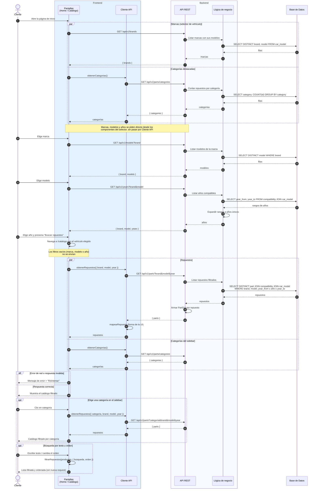

# Secuencia: búsqueda de repuestos por vehículo

```mermaid
---
config:
  theme: mc
---
sequenceDiagram
    autonumber
    actor C as Cliente

    box rgb(227,240,255) Frontend
        participant P as Pantallas<br/>(Home / Catálogo)
        participant A as Cliente API
    end

    box rgb(247,251,255) Backend
        participant R as API REST
        participant L as Lógica de negocio
    end

    participant DB as Base de Datos

    C->>P: Abre la página de inicio

    par Marcas (selector de vehículo)
        P->>R: GET /api/v1/brands
        R->>L: Listar marcas con sus modelos
        L->>DB: SELECT DISTINCT brand, model FROM car_model
        DB-->>L: filas
        L-->>R: marcas
        R-->>P: { brands }
    and Categorías destacadas
        P->>A: obtenerCategorias()
        A->>R: GET /api/v1/parts/categories
        R->>L: Contar repuestos por categoría
        L->>DB: SELECT category, COUNT(id) GROUP BY category
        DB-->>L: filas
        L-->>R: categorías
        R-->>A: { categories }
        A-->>P: categorías
    end

    Note over P,R: Marcas, modelos y años se piden directo desde los<br/>componentes del selector, sin pasar por Cliente API

    C->>P: Elige marca
    P->>R: GET /api/v1/models?brand
    R->>L: Listar modelos de la marca
    L->>DB: SELECT DISTINCT model WHERE brand
    DB-->>L: filas
    L-->>R: modelos
    R-->>P: { brand, models }

    C->>P: Elige modelo
    P->>R: GET /api/v1/years?brand&model
    R->>L: Listar años compatibles
    L->>DB: SELECT year_from, year_to FROM compatibility JOIN car_model
    DB-->>L: rangos de años
    L->>L: Expandir rangos a años únicos
    L-->>R: años
    R-->>P: { brand, model, years }

    C->>P: Elige año y presiona "Buscar repuestos"
    P->>P: Navega a /catalogo con el vehículo elegido
    Note over P: Los filtros vacíos (marca, modelo o año)<br/>no se envían

    par Repuestos
        P->>A: obtenerRepuestos({ brand, model, year })
        A->>R: GET /api/v1/parts?brand&model&year
        R->>L: Listar repuestos filtrados
        L->>DB: SELECT DISTINCT part JOIN compatibility JOIN car_model<br/>WHERE brand, model, year_from ≤ año ≤ year_to
        DB-->>L: repuestos
        L-->>R: repuestos
        R->>R: Armar PartOut por repuesto
        R-->>A: { parts }
        A->>A: mapearRepuesto (forma de la UI)
        A-->>P: repuestos
    and Categorías del sidebar
        P->>A: obtenerCategorias()
        A->>R: GET /api/v1/parts/categories
        R-->>A: { categories }
        A-->>P: categorías
    end

    alt Error de red o respuesta inválida
        P-->>C: Mensaje de error + "Reintentar"
    else Respuesta correcta
        P-->>C: Muestra el catálogo filtrado
    end

    opt Elige una categoría en el sidebar
        C->>P: Clic en categoría
        P->>A: obtenerRepuestos({ categoria, brand, model, year })
        A->>R: GET /api/v1/parts?categoria&brand&model&year
        R-->>A: { parts }
        A-->>P: repuestos
        P-->>C: Catálogo filtrado por categoría
    end

    opt Búsqueda por texto u orden
        C->>P: Escribe texto / cambia el orden
        P->>P: filtrarRepuestos(productos, { busqueda, orden })
        P-->>C: Lista filtrada y ordenada (sin nueva request)
    end
```
