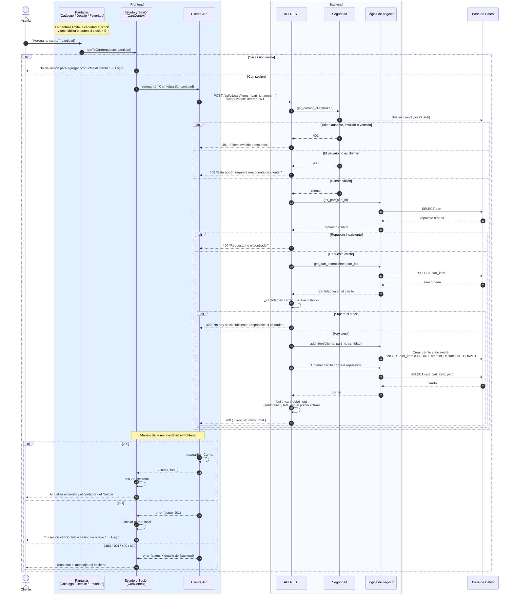

# Secuencia: agregar un repuesto al carrito

```mermaid
---
config:
  theme: mc
---
sequenceDiagram
    autonumber
    actor C as Cliente

    box rgb(227,240,255) Frontend
        participant P as Pantallas<br/>(Catálogo / Detalle / Favoritos)
        participant S as Estado y Sesión<br/>(CartContext)
        participant A as Cliente API
    end

    box rgb(247,251,255) Backend
        participant R as API REST
        participant Seg as Seguridad
        participant L as Lógica de negocio
    end

    participant DB as Base de Datos

    Note over P: La pantalla limita la cantidad al stock<br/>y deshabilita el botón si stock = 0
    C->>P: "Agregar al carrito" (cantidad)
    P->>S: addToCart(repuesto, cantidad)

    alt Sin sesión válida
        S-->>C: "Iniciá sesión para agregar productos al carrito." → Login
    else Con sesión
        S->>A: agregarItemCarrito(partId, cantidad)
        A->>R: POST /api/v1/cart/items { part_id, amount }<br/>Authorization: Bearer JWT
        R->>Seg: get_current_client(token)
        Seg->>DB: Buscar cliente por id (sub)

        alt Token ausente, inválido o vencido
            Seg-->>R: 401
            R-->>A: 401 "Token inválido o expirado."
        else El usuario no es cliente
            Seg-->>R: 403
            R-->>A: 403 "Esta acción requiere una cuenta de cliente."
        else Cliente válido
            Seg-->>R: cliente
            R->>L: get_part(part_id)
            L->>DB: SELECT part
            DB-->>L: repuesto o nada
            L-->>R: repuesto o nada

            alt Repuesto inexistente
                R-->>A: 404 "Repuesto no encontrado."
            else Repuesto existe
                R->>L: get_cart_item(cliente, part_id)
                L->>DB: SELECT cart_item
                DB-->>L: item o nada
                L-->>R: cantidad ya en el carrito
                R->>R: ¿cantidad en carrito + nueva > stock?

                alt Supera el stock
                    R-->>A: 409 "No hay stock suficiente. Disponible: N unidades."
                else Hay stock
                    R->>L: add_item(cliente, part_id, cantidad)
                    L->>DB: Crear carrito si no existe ·<br/>INSERT cart_item o UPDATE amount += cantidad · COMMIT
                    R->>L: Obtener carrito con sus repuestos
                    L->>DB: SELECT cart, cart_item, part
                    DB-->>L: carrito
                    L-->>R: carrito
                    R->>R: build_cart_detail_out<br/>(subtotales y total con el precio actual)
                    R-->>A: 200 { client_id, items, total }
                end
            end
        end

        Note over S,A: Manejo de la respuesta en el frontend
        alt 200
            A->>A: mapearItemCarrito
            A-->>S: { items, total }
            S->>S: setCart, setTotal
            S-->>C: Actualiza el carrito y el contador del Navbar
        else 401
            A-->>S: error (status 401)
            S->>S: Limpiar carrito local
            S-->>C: "Tu sesión venció. Iniciá sesión de nuevo." → Login
        else 403 / 404 / 409 / 422
            A-->>S: error (status + detalle del backend)
            S-->>C: Toast con el mensaje del backend
        end
    end
```
