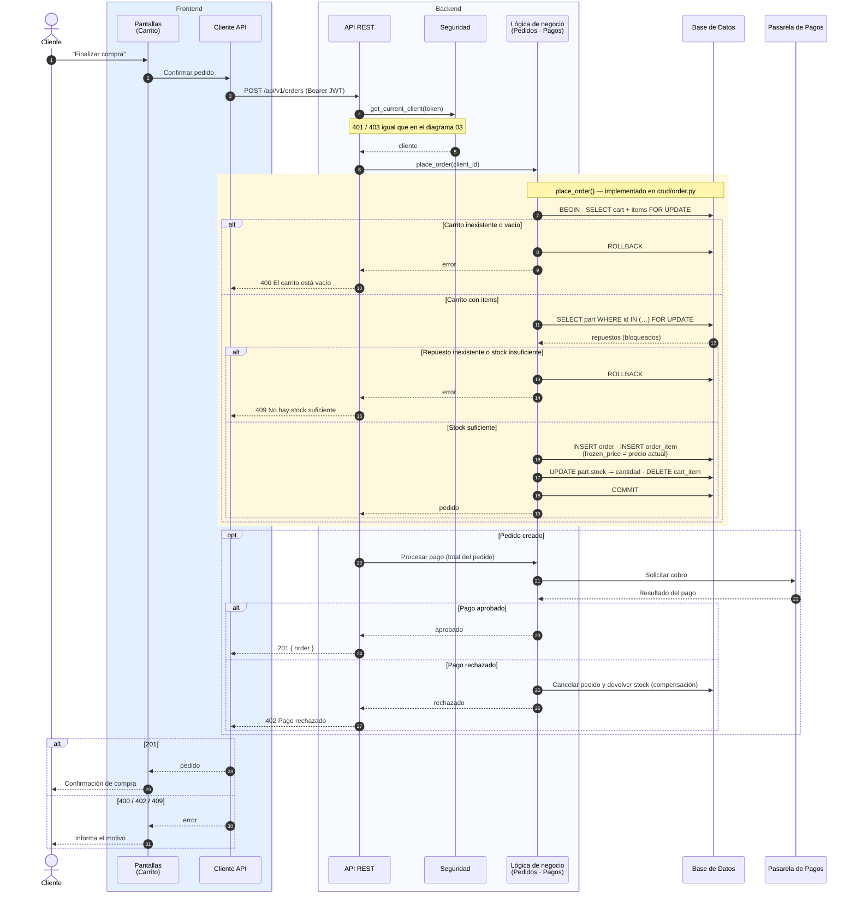

# Secuencia: finalizar compra *(planificado)*

> **Estado actual:** el botón "FINALIZAR COMPRA" de `Carrito.jsx` todavía no tiene
> acción y no existe ningún endpoint de pedidos. Lo único implementado es la
> transacción `place_order()` en `backend/app/crud/order.py` (recuadro amarillo
> en el diagrama).
>
> **Propuesto (a confirmar con el equipo):** el endpoint `POST /api/v1/orders`, los
> códigos de respuesta (400 / 409 / 402 / 201), la integración con la pasarela y el
> orden "primero se reserva el stock y se crea el pedido, después se cobra". Con ese
> orden nunca se cobra un pedido que no se puede cumplir, pero un pago rechazado
> obliga a deshacer el pedido. `Order` todavía no tiene un campo de estado
> (pendiente / pagado / cancelado), así que cómo representar eso es una decisión
> pendiente.

