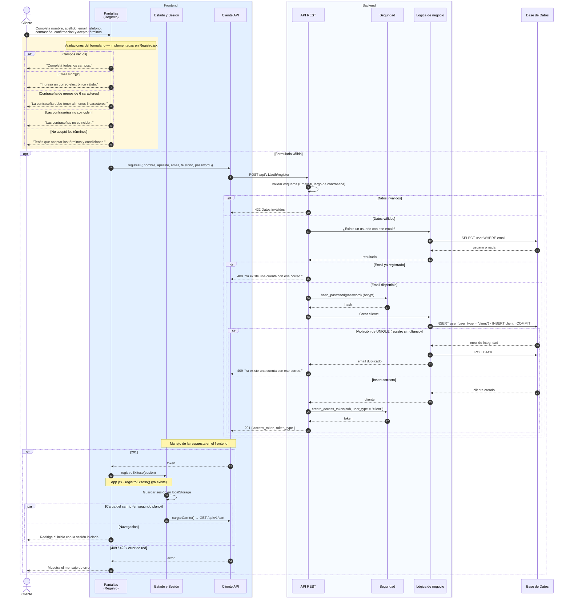

# Secuencia: registro de cliente *(preliminar)*

> **Estado actual:** `Registro.jsx` valida el formulario y guarda el usuario
> **solo en `localStorage`** (`autobought-usuarios`, con la contraseña en texto
> plano). No existe endpoint de registro, así que esos usuarios no pueden iniciar
> sesión contra la API.
>
> **Ya existe y se reutiliza:** las validaciones del formulario (recuadro amarillo),
> `hash_password()` y `create_access_token()` en `core/security.py`, el modelo
> `Client` (herencia de `User`) y el auto-login posterior al registro
> (`App.jsx · registroExitoso()`).
>
> **Propuesto (a confirmar con el equipo):**
> - Endpoint `POST /api/v1/auth/register` con respuesta `201 { access_token }`, para
>   que el registro deje la sesión iniciada como hoy.
> - `409` si el email ya está registrado (también si dos registros compiten y salta
>   la restricción `UNIQUE`).
> - **Diferencias de datos a resolver:** el formulario pide `apellido` y `telefono`,
>   que no existen en `User`; y `User.username` es obligatorio y único, pero el
>   formulario no lo pide. Opciones: agregar columnas, guardar `name = nombre +
>   apellido`, y derivar `username` del email o pedirlo en el formulario.

